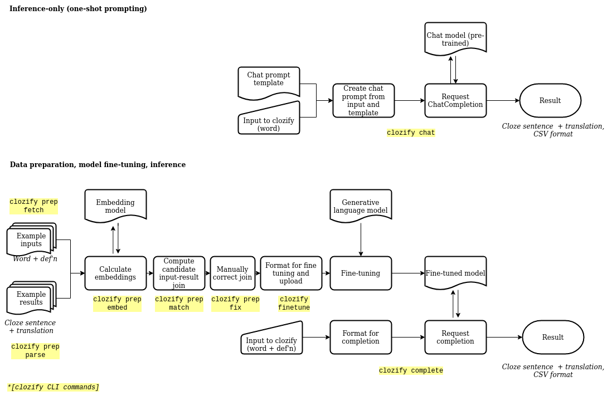

# clozify-llm

A tiny tool to help generate sentences for Clozemaster language learning using large language models (LLM).

Wraps around the OpenAI API.

## Why?

I like using Clozemaster. I like the language resources on DW's Learn German site. I like adding words from the word lists in the DW Learn German lessons but the words are often too specialized to have existing Clozes.

I can trawl the web to find examples. (Thank you, search bars on German public radio websites!) And sometimes the searching for a good example is a helpful part of the learning itself. But sometimes I also just want to add sentences to Clozemaster.

The idea here is prompting a LLM for each word in a list and requesting a response that's already in the CSV format Clozemaster accepts for batch uploads.

I've experimented with two approaches:
- A one-shot approach that uses a `STARTING_MESSAGE` to prompt ChatGPT with an example prompt and response
- A fine-tuning approach that uses a completion model (e.g. OpenAI "curie") fine-tuned on a number of existing example cloze creations. This requires an appropriate training data set.



## How?

You're gonna need an OpenAI account and API key (assumed to be available at standard `OPENAI_API_KEY` env var). It's gonna cost ya once you run through the free credits.

### Install

```bash
$ poetry install
```

This installs the dependencies in a `poetry` environment as well as a simple CLI named `clozify`.

Verify installation:

```bash
$ poetry shell
$ clozify --help
Usage: clozify [OPTIONS] COMMAND [ARGS]...

  Use LLMs to generate cloze sentences.

Options:
  --help  Show this message and exit.

Commands:
  chat      Generate clozes using a chat model
  complete  Generate clozes using a completion model
  finetune  Start completion model fine-tuning from training data
  prep      Prepare training data for model fine-tuning.
```

### CLI usage

#### `clozify chat`

`clozify chat` uses a list of vocabulary words and a chat completion request. Example:

```bash
$ echo "regional" > vocab.txt
$ echo "Waschbär" >> vocab.txt
$ clozify chat -f vocab.txt -o out_clozes.csv
response for regional received, total usage 104
response for Waschbär received, total usage 107
wrote 2 responses to out_clozes.csv
$ cat clozes.csv
"Die regionale Küche ist sehr vielfältig und lecker.","The regional cuisine is very diverse and delicious.","regional"
"Der Waschbär ist ein nachtaktives Tier.","The raccoon is a nocturnal animal.","Waschbär"
```

#### `clozify complete`

`clozify complete` uses a list of vocabulary words and definitions, and a fine-tuned completion model request. Example:

```bash
$ cat my_inputs.csv
word,defn
"Ausrede, -n (f.)","eine Erklärung, die aber nicht ganz wahr ist und die eine Entschuldigung für etwas sein soll"
"Bank (f.)","Unternehmen, das Geld- und Kreditgeschäfte betreibt und den Zahlungsverkehr vermittelt"
"Bank (f.)","Sitzgelegenheit aus Holz, Stein o. Ä., die mehreren Personen nebeneinander Platz bietet"
$ clozify complete -f my_inputs.csv -m 'curie:ft-personal-2023-01-01-01-01-01' -o my_clozes.csv
response for Ausrede, -n (f.) received, total usage 80
response for Bank (f.) received, total usage 77
response for Bank (f.) received, total usage 83
$ cat my_clozes.csv
 Ich muss diese Ausrede nicht erfinden.,I don't have to come up with an excuse.,Ausrede
 Sie müssen nur ein Konto bei einer deutschen Bank haben.,You only need a bank account in Germany.,Bank
 Ein Bank ist eine Möbelstück, die zur Sitzgelegenheit dient.,A bench is a piece of furniture that serves as a seating device.,Bank
```

#### `clozify finetune`

Start a model fine-tuning job assuming a training data set is available (see "Data prep", below).

```bash
$ clozify finetune --help
Usage: clozify finetune [OPTIONS] CSV_FILE TRAINING_DATA_OUTPUT

  Start completion model fine-tuning from training data

  Start model fine-tuning using data in CSV_FILE written to
  TRAINING_DATA_OUTPUT in the format that is uploaded for fine-tuning. Details
  of the FineTune job is printed.

Options:
  --help  Show this message and exit.
```

#### Data prep

Helper functions are included that help extract clozes and vocabulary lists. Running these require installing the optional "prep" group of dependencies into the poetry environment.

The steps include:
1) Wrangle vocab and cloze data into a standard format
2) Generate embeddings for the vocab and cloze words
3) Join the vocab to the cloze sentences based on embedding similarities
4) Manually review the join and fix any errors

These steps are available through the CLI tool via the `prep` subcommmand.

```bash
$ clozify prep --help
Usage: clozify prep [OPTIONS] COMMAND [ARGS]...

  Prepare training data for model fine-tuning.

Options:
  --help  Show this message and exit.

Commands:
  embed  Get embeddings for the word or cloze in the input
  fetch  Get vocabulary from a course
  fix    Update candidate training data based on manual review
  match  Join cloze and vocab data based on embedding similarities
  parse  Extract clozes from scraped json data
```

## Limitations

This is relying on machine translation so all limitations there apply. The output might have subtle issues with grammar, idiomatic usage, etc. The assumption is the output will receive manual human review for these issues before being added to a flashcard set.

The output appears to struggle with identifying when the input word was inflected in the output. This has an impact on how Clozemaster ingests the list of sentences and identifies the cloze. This could probably be cleaned up with some postprocessing rules, but again, manual human review can also catch.

Cleaning of the output might be necessary if the CSV format gets mangled in some responses.

There is no content filtering applied for potentially objectionable material.

Certain parameters are hard-coded (model, temperature, etc.).

## Development

Environment managed with `poetry` v1.4.

Autoformatting checks managed with `pre-commit`.

## References

This was inspired by Matt Webb's description of his Braggoscope project ([about page](https://genmon.github.io/braggoscope/about), [blog writeup](https://interconnected.org/home/2023/02/07/braggoscope)), which uses ChatGPT to extract data from *In Our Time* shownotes and perform some other tasks (embeddings).

Robin Sloan's [gloss](https://www.robinsloan.com/lab/phase-change/) also provided a nudge:

> Where the GPT-alikes are concerned, a question that’s emerging for me is:
>
> *What could I do with a universal function — a tool for turning just about any X into just about any Y with plain language instructions?*
